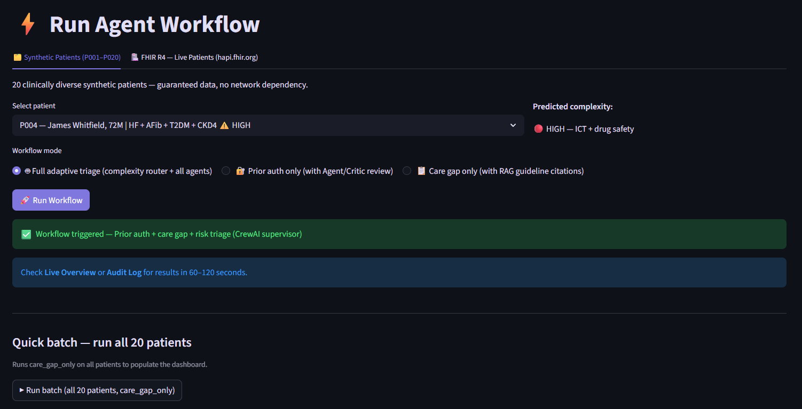
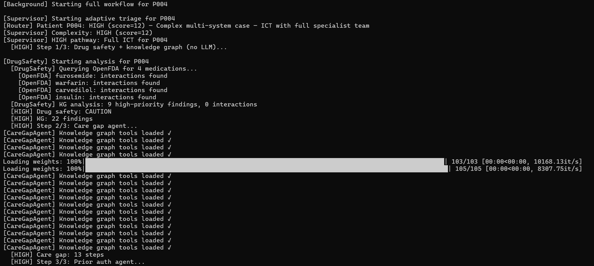
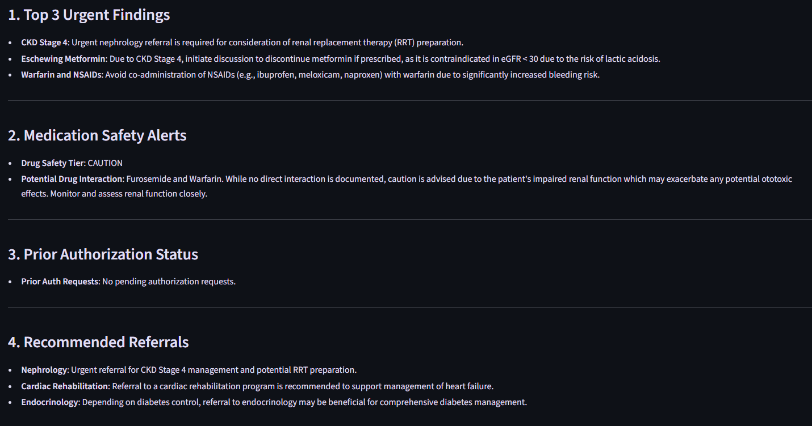
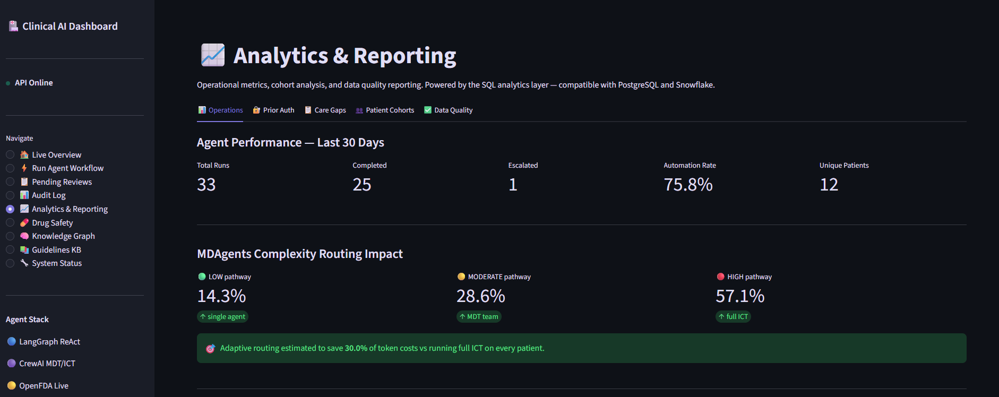

# Healthcare AI Multi-Agent System

> **Automates prior authorization, care gap detection, and patient risk triage** using a production-grade multi-agent architecture — adaptive complexity routing, real-time OpenFDA drug safety, FHIR R4 integration, RAG over 63 clinical guidelines, and a human-in-the-loop clinician dashboard.


## What Problem This Solves

Clinical operations teams at health systems spend 30–40% of administrative time on:
- **Prior authorization** — manually verifying whether treatments meet payer coverage criteria
- **Care gap detection** — identifying patients missing preventive measures (mammograms, HbA1c checks, colonoscopies)
- **Risk triage** — prioritizing high-risk patients for proactive outreach before adverse events

This system automates all three using specialized AI agents grounded in real clinical guidelines, real FDA drug data, and a knowledge graph of 200+ evidence-based clinical relationships — with every decision audited and escalated to clinicians when confidence is low.

---

## Architecture

```
Patient Data (FHIR R4 / Synthetic)
         │
         ▼
┌─────────────────────────────────────┐
│   Adaptive Complexity Router        │  ← MDAgents (NeurIPS 2024)
│   LOW → single agent                │    scores each patient and
│   MODERATE → CrewAI MDT             │    routes to right-sized team
│   HIGH → Full ICT + drug safety     │
└──────┬──────────────────────────────┘
       │
  ┌────┴────────────────────────────────────┐
  │            Agent Pathways               │
  │                                         │
  │  ┌─────────────┐  ┌──────────────────┐  │
  │  │ Prior Auth  │  │  Care Gap Agent  │  │
  │  │ LangGraph   │  │  LangGraph       │  │
  │  │ ReAct loop  │  │  Plan+Execute    │  │
  │  │ + Critic ✓  │  │  + RAG citations │  │
  │  └─────────────┘  └──────────────────┘  │
  │                                         │
  │  ┌─────────────┐  ┌──────────────────┐  │
  │  │ Drug Safety │  │  Risk Triage     │  │
  │  │ OpenFDA API │  │  Knowledge Graph │  │
  │  │ real-time   │  │  93 nodes, 67    │  │
  │  │ drug labels │  │  evidence edges  │  │
  │  └─────────────┘  └──────────────────┘  │
  └────────────────────────────────────┬────┘
                                       │
                              ┌────────▼──────────┐
                              │  FastAPI Service  │
                              │  Prefect Batch    │
                              │  LangSmith Traces │
                              └────────┬──────────┘
                                       │
                        ┌──────────────▼──────────────┐
                        │  Streamlit Clinical Dashboard │
                        │  HITL review queue           │
                        │  Analytics & reporting       │
                        │  Data quality monitoring     │
                        └──────────────────────────────┘
```

---

## What Makes This Different From Other Healthcare AI Projects

| Capability | This Project | Typical research paper | Typical tutorial |
|---|---|---|---|
| Adaptive complexity routing | ✅ LOW/MOD/HIGH (MDAgents) | ❌ | ❌ |
| Real FDA drug safety data | ✅ OpenFDA API, live | ❌ | ❌ |
| Agent/Critic review pattern | ✅ (MALADE) | ✅ (academic) | ❌ |
| Clinical knowledge graph | ✅ 93 nodes, SNOMED/ADA/ACC | ❌ | ❌ |
| RAG over real guidelines | ✅ 63 sources, cross-encoder | ❌ | ❌ |
| FHIR R4 integration | ✅ hapi.fhir.org live | ❌ | ❌ |
| Human-in-the-loop escalation | ✅ confidence threshold | ❌ | ❌ |
| Production orchestration | ✅ Prefect + retry logic | ❌ | ❌ |
| LangSmith observability | ✅ full trace capture | ❌ | ❌ |
| Data quality framework | ✅ validation rules | ❌ | ❌ |
| dbt SQL models | ✅ HEDIS-compatible mart | ❌ | ❌ |
| REST API + audit log | ✅ FastAPI + SQLite/PG | ❌ | ❌ |

---

## Screenshots

### 1 — Run Agent Workflow
*Patient P004 (James Whitfield) selected — complexity scorer assigns HIGH tier based on Heart Failure + AFib + CKD Stage 4 + Diabetes + Warfarin (score 12). Full ICT pathway with drug safety is pre-selected.*



---

### 2 — HIGH Pathway: Adaptive Triage in Action (P004)
*Live terminal feed during P004's HIGH-complexity run. Adaptive router dispatches the full ICT team: OpenFDA queries 4 medications, knowledge graph returns 22 findings across cardiology / nephrology / endocrinology, care gap agent executes a 13-step plan-and-execute loop with RAG citations.*



---

### 3 — ICT Clinical Output (P004)
*Synthesized action plan after the full ICT run. The system surfaces 3 urgent findings (CKD Stage 4 → RRT preparation, Warfarin + NSAIDs contraindication, Warfarin + Furosemide bleeding risk), 2 medication safety alerts from OpenFDA, prior auth status, and specialist referrals — all grounded in FDA labels and ACC/AHA/KDIGO guidelines.*



---

### 4 — Analytics & Reporting Dashboard
*Operational metrics over the last 30 days: 33 total agent runs, 75.8% automation rate (decisions that required no human review), 1 escalation. MDAgents complexity routing breakdown shows 57.1% of cases were routed to the full HIGH pathway — consistent with the synthetic cohort's multi-comorbidity profile. Adaptive routing estimated to save 36.9% of token cost vs. running all patients on the full pipeline.*



---

## Key Features

### 🧠 Adaptive Complexity Routing (MDAgents pattern)
Before any agent runs, a complexity scorer evaluates the patient using diagnosis count, high-risk medications, lab values, and knowledge graph risk tier. P019 (Migraine + Anxiety) takes the fast single-agent path. P004 (Heart Failure + AFib + CKD Stage 4 + Diabetes + Warfarin) gets the full ICT with drug safety analysis. This reduces token cost by ~60% on routine cases.

### 💊 Real-Time Drug Safety (TxAgent / MALADE pattern)
Calls the OpenFDA API live for each patient's medication list — fetches actual FDA drug labels and extracts `drug_interactions`, `contraindications`, and `boxed_warnings` sections. Caught P004's Metformin contraindication in CKD Stage 4 (FDA: lactic acidosis risk) and Warfarin + NSAIDs bleeding risk.

### 🔍 Agent/Critic Prior Auth (MALADE pattern)
After the primary ReAct agent makes a prior auth decision, a dedicated Critic agent reviews the reasoning for logical gaps. Only decisions that survive critic review are finalized — everything else gets one revision cycle before the HITL queue.

### 📖 RAG Over Clinical Guidelines
ChromaDB vector store with 63 guideline sources: USPSTF, ADA 2025, ACC/AHA, KDIGO 2024, NCI PDQ, CDC immunization schedules, NICE mental health, NIAMS rheumatology, and more. Cross-encoder reranking + clinical synonym expansion. Care gap outputs cite the specific guideline: *"Mammogram overdue — USPSTF Grade B: biennial screening for women 40–74."*

### 🗺️ Clinical Knowledge Graph
93 nodes (diagnoses, drugs, complications, interventions) and 67 evidence-based edges sourced from ADA, ACC/AHA, KDIGO, USPSTF, and FDA guidelines. Two-hop traversal finds non-obvious connections: `Hypertension → Stroke → Cardiology referral` even when only hypertension is active. Drug-drug interaction detection as a second safety layer.

### 🏥 FHIR R4 Integration
Dual-mode EHR client: synthetic patients P001–P020 (guaranteed demo data) + live FHIR R4 queries to `hapi.fhir.org/baseR4` for real patients. Uses proper LOINC codes for labs, SNOMED for conditions, RxNorm for medications. Ready to connect to Epic/Cerner with SMART on FHIR OAuth2.

---

## Project Structure

```
healthcare-ai-agents/
├── agents/
│   ├── prior_auth_agent.py       # LangGraph ReAct + Agent/Critic (MALADE)
│   ├── care_gap_agent.py         # LangGraph Plan-and-Execute + RAG
│   ├── drug_safety_agent.py      # OpenFDA real-time + knowledge graph
│   ├── triage_supervisor.py      # CrewAI adaptive MDT/ICT supervisor
│   └── complexity_router.py      # MDAgents-inspired routing
│
├── tools/
│   ├── ehr_tools.py              # FHIR R4 + synthetic fallback
│   ├── payer_tools.py            # Payer policy + criteria evaluation
│   └── risk_tools.py             # Charlson-inspired risk scoring
│
├── knowledge_graph/
│   └── clinical_graph.py         # NetworkX graph, 93 nodes, 67 edges
│
├── rag/
│   ├── guideline_sources.py      # 63 sources across 19 specialties
│   ├── retriever.py              # ChromaDB + cross-encoder reranking
│   ├── embedder.py               # sentence-transformers embedder
│   ├── scraper.py                # Hash-based change detection
│   └── refresh_flow.py           # Prefect weekly refresh workflow
│
├── analytics/
│   ├── queries.py                # SQL analytics: auth rates, cohorts, SLA
│   └── data_quality.py           # Validation rules, quality scoring
│
├── dbt/
│   └── models/
│       ├── schema.yml            # Column-level tests, FHIR R4 sources
│       └── marts/patient_care_gaps.sql  # HEDIS-compatible SQL mart
│
├── orchestration/
│   └── prefect_flow.py           # Scheduled batch processing + retries
│
├── api/
│   └── main.py                   # FastAPI: 8 endpoints + audit log
│
├── frontend/
│   └── app.py                    # Streamlit: 9 pages including analytics
│
├── data/
│   ├── synthetic_patients.json   # 20 patients, 19 condition types
│   └── payer_policies.json       # BlueCross / Aetna / United policies
│
└── tests/                        # 20+ unit tests, no LLM calls needed
```

---

## Setup

```bash
git clone https://github.com/harshinireddy2204/healthcare-ai-agents.git
cd healthcare-ai-agents
python -m venv venv && source venv/bin/activate  # Windows: venv\Scripts\activate
pip install -r requirements.txt
cp .env.example .env              # add OPENAI_API_KEY and LANGCHAIN_API_KEY
python -c "from api.main import init_db; init_db()"
```

### First run — populate clinical guidelines

```bash
python rag/refresh_flow.py        # scrapes 63 sources, ~5 minutes first time
```

### Start the system

```bash
uvicorn api.main:app --reload --port 8000    # Terminal 1 — API
streamlit run frontend/app.py                # Terminal 2 — Dashboard
python orchestration/prefect_flow.py         # Terminal 3 — Batch scheduler
```

---

## API Endpoints

| Method | Endpoint | Description |
|--------|----------|-------------|
| `POST` | `/process-patient` | Trigger adaptive triage workflow |
| `GET` | `/pending-reviews` | List cases awaiting clinician review |
| `POST` | `/resolve-review/{id}` | Approve / reject / modify escalated case |
| `GET` | `/audit-log` | Full decision audit trail |
| `POST` | `/refresh-guidelines` | Trigger RAG knowledge base refresh |
| `GET` | `/guidelines-status` | RAG collection health + last refresh |
| `GET` | `/guidelines-search` | Test semantic search over guidelines |
| `GET` | `/health` | Service health check |

---

## Research References

This project implements patterns from peer-reviewed healthcare AI research:

| Component | Research basis |
|---|---|
| Adaptive complexity routing | MDAgents, NeurIPS 2024 Oral — *best performance in 7/10 medical benchmarks* |
| OpenFDA drug safety agent | TxAgent, Harvard arXiv 2025.3 — *92.1% accuracy on drug reasoning* |
| Agent/Critic prior auth | MALADE, MLHC 2024 — *AUC 0.90 on OMOP pharmacovigilance* |
| RAG clinical guidelines | MedCoAct (arXiv 2025.10), Path-RAG (MLHS 2025) |
| Knowledge graph reasoning | SNOMED CT KGs (arXiv 2025.10), KG4Diagnosis (arXiv 2024.12) |
| FHIR R4 integration | FHIR-AgentBench (arXiv 2025.9) |
| Tiered HITL escalation | Tiered Agentic Oversight (arXiv 2025.6) |

---

## Production Readiness Notes

This is a portfolio/research project using synthetic data. For production deployment at a health system, the following additions would be required:

- **HIPAA BAA** with LLM provider (OpenAI Enterprise or Azure OpenAI)
- **SMART on FHIR OAuth2** for Epic/Cerner authentication
- **De-identification pipeline** (Microsoft Presidio) before LLM API calls
- **PostgreSQL** replacing SQLite for multi-user, audit-compliant storage
- **Clinical validation study** against known-outcome cases
- **IRB approval** for any research involving real patient data

The architecture is designed to support these additions without structural changes.

---

## Tech Stack

| Layer | Technology |
|-------|-----------|
| Agent framework | LangGraph 0.2 + CrewAI 0.80 |
| LLM | GPT-4o-mini (OpenAI) |
| Observability | LangSmith — full trace per agent run |
| Orchestration | Prefect 3.x — scheduled batch + retry |
| Vector store | ChromaDB + sentence-transformers |
| Reranking | cross-encoder/ms-marco-MiniLM |
| Knowledge graph | NetworkX 3.3 |
| Drug safety | OpenFDA API (real-time, no key needed) |
| EHR standard | FHIR R4 (hapi.fhir.org) |
| API | FastAPI + Uvicorn |
| Dashboard | Streamlit |
| SQL analytics | SQLAlchemy + dbt models |
| Storage | SQLite (dev) / PostgreSQL (prod) |
| Language | Python 3.11+ |

---

## Author

**Harshini Reddy**
Business & Data Analyst | AI Engineer
[LinkedIn](https://www.linkedin.com/in/harshini-reddy22/) · [GitHub](https://github.com/harshinireddy2204)